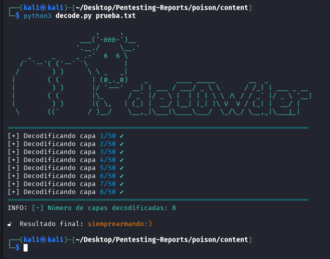

# 🧰 decowder — Multi-layer Base64 Decoder (Pentesting Tool)

**decowder** es una herramienta de línea de comandos para decodificar cadenas que han sido codificadas en Base64 múltiples veces. Diseñada con estilo y funcionalidad para CTFs, pruebas de penetración esta utilidad automatiza el proceso de desencriptado mostrando cada capa de forma interactiva.

---

## ✨ Características

- 🔁 Decodificación iterativa y automática de múltiples capas Base64.
- ✅ Validación robusta para evitar errores de formato corrupto.
- 🧪 Límite configurable de capas para prevenir bucles infinitos.
- 🐞 Modo verbose con logs detallados para debugging.
- 💾 Soporte para salida a archivo opcional.

---
## demo



## 🐍 Requisitos

- Python 3.6 o superior

---

## 📦 Instalación

```bash
git clone https://github.com/tuusuario/decowder.git
cd decowder
chmod +x decowder.py
```

---

## 🚀 Uso

### Decodificar un archivo codificado múltiples veces:

```bash
python3 decowder.py pass.txt
```

### Especificar un máximo de iteraciones (por defecto: 50)

```bash
python3 decowder.py pass.txt -m 20
```

### Guardar el resultado decodificado:

```bash
python3 decowder.py pass.txt -o resultado.txt
```

### Activar modo verbose para depuración:

```bash
python3 decowder.py pass.txt -v
```

---


## 🛠️ Casos de uso

- 🔐 Análisis de datos ofuscados en CTFs.
- 🧑‍💻 Pruebas de penetración donde se requiere descifrado masivo.
- 📁 Limpieza de cadenas en logs o dumps hexadecimales.

---

## 🤝 Contribuciones

Contribuciones, issues y pull requests son bienvenidas. ¡Toda mejora cuenta!