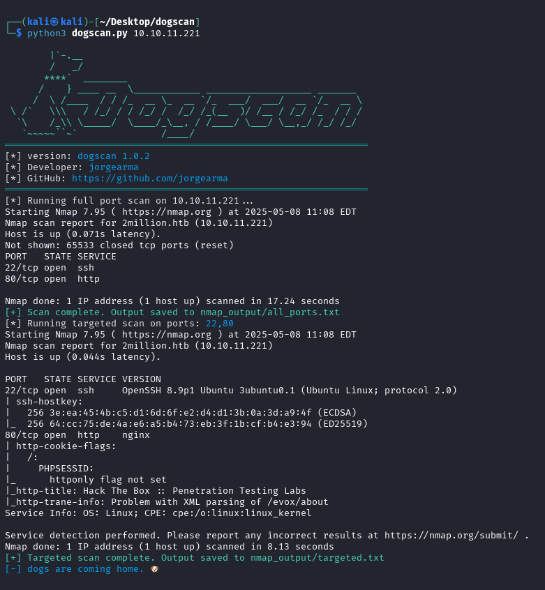

# 🐶 dogscan

**dogscan** es un sencillo pero potente wrapper para `nmap` que automatiza dos fases esenciales de escaneo:

1. Escaneo completo de todos los puertos (`-p-`)
2. Escaneo detallado con scripts y detección de versiones (`-sC -sV`) sobre los puertos abiertos
3. Creates a folder with the results in human-readable text format

Ideal para tareas de reconocimiento en auditorías de seguridad y pentesting.

---

## 🚀 Características

- Escaneo completo de puertos TCP (`nmap -p-`)
- Detección de servicios y versiones (`-sC -sV`)
- Salida organizada en la carpeta `nmap_output/`
- Arte ASCII personalizado y colores en terminal
- Detección de puertos abiertos
- Validación de IP
- Manejo de errores comunes y cancelación con Ctrl+C

---

## 📦 Requisitos

- Python 3.x
- [Nmap](https://nmap.org/) instalado y disponible en el `$PATH`

